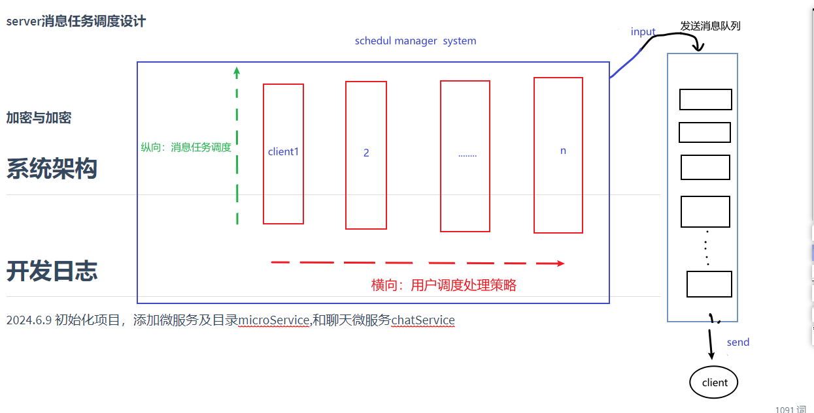
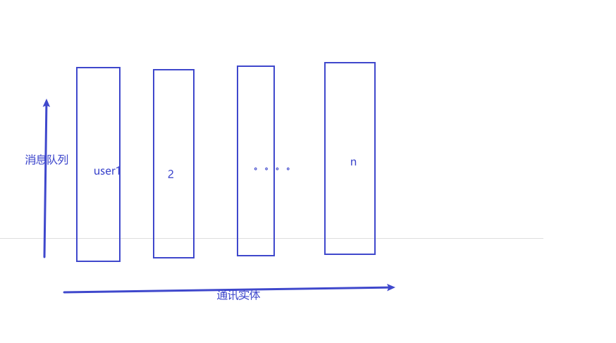

# life_cycler

这是一款致力于隐私保护的去中心化聊天微服务为生态中心的跨平台应用程序，让应用的控制权交由用户管理与控制。


## 特性

* 去中心化
* 微服务架构
* 布局自适应
* 可拓展插件化
* 二次开发且集成


## 目录结构


## 下载


## 数据库设计

### 用户表 (user)

用户表用来存储应用中所有用户的基本信息。

**字段说明**:

1. `id`: 用户的唯一标识符，通常是自增的整数。
2. `username`: 用户的用户名，必须是唯一的。
3. `email`: 用户的电子邮件地址，也必须是唯一的。
4. `password_hash`: 用户的密码哈希值，确保密码安全。
5. `created_at`: 账户创建时间戳。
6. `updated_at`: 用户信息的最近更新时间戳。
7. `profile_picture`: 用户的头像URL（可选）。
8. `status`: 用户当前的状态（在线、离线、勿扰等）（可选）

##### sql语句：

```sql
CREATE TABLE user (
    id SERIAL PRIMARY KEY,
    username VARCHAR(50) UNIQUE NOT NULL,
    email VARCHAR(100) UNIQUE NOT NULL,
    password_hash VARCHAR(255) NOT NULL,
    created_at TIMESTAMP DEFAULT CURRENT_TIMESTAMP,
    updated_at TIMESTAMP DEFAULT CURRENT_TIMESTAMP ON UPDATE CURRENT_TIMESTAMP,
    profile_picture VARCHAR(255),
    status VARCHAR(50)
);
```

### 消息表 (chat)

消息表用来存储应用中所有的聊天消息。

**字段说明**:

1. `id`: 消息的唯一标识符，通常是自增的整数。
2. `sender_id`: 发送消息的用户ID，外键关联到 `user` 表的 `id`。
3. `receiver_id`: 接收消息的用户ID，外键关联到 `user` 表的 `id`。如果是群组聊天，可以用此字段存储群组ID。
4. `content`: 消息的文本内容。
5. `created_at`: 消息发送的时间戳。
6. `is_read`: 表示消息是否已被接收者阅读。
7. `message_type`: 消息的类型（文本、图片、文件等）。

##### sql语句：

```sql
CREATE TABLE chat (
    id SERIAL PRIMARY KEY,
    sender_id INT NOT NULL REFERENCES user(id) ON DELETE CASCADE,
    receiver_id INT NOT NULL REFERENCES user(id) ON DELETE CASCADE,
    content TEXT NOT NULL,
    created_at TIMESTAMP DEFAULT CURRENT_TIMESTAMP,
    is_read BOOLEAN DEFAULT FALSE,
    message_type VARCHAR(50) DEFAULT 'text'
);
```

##### 表定义类

UserTable.dart 文件


ChatTable.dart文件


### 数据库设计细节与约束

1. **关系与外键**:
   - `chat` 表中的 `sender_id` 和 `receiver_id` 都是 `user` 表的外键，这样可以确保每条消息都有有效的发送者和接收者。
   - 使用 `ON DELETE CASCADE` 确保当用户被删除时，相关的消息也会被自动删除，避免孤立记录。
2. **索引**:
   - 为 `user` 表的 `username` 和 `email` 字段创建唯一索引，以确保这些字段的唯一性。
   - 为 `chat` 表中的 `sender_id` 和 `receiver_id` 创建索引，可以加快按用户查询消息的速度。
3. **时间戳**:
   - `created_at` 字段记录了记录的创建时间，这在消息排序和用户注册时间上非常重要。
   - `updated_at` 字段在 `user` 表中帮助记录最后的更新时间。
4. **数据安全与隐私**:
   - `password_hash` 存储用户密码的哈希值而不是明文，增强了安全性。
   - 对于聊天应用，保持数据的安全和隐私是至关重要的，确保对敏感数据的适当加密和保护。
5. **扩展性**:
   - 可以在 `user` 表中添加更多的字段以支持附加功能（如用户的偏好设置、个人描述等）。
   - 在 `chat` 表中，可以通过 `message_type` 字段扩展消息类型，以支持多媒体消息、文件等。


## websocket服务端设计

websocket server服务端处理总消息队列的策略

1. **被动触发**：在listen中监听到消息时被动立即转发该消息，不需要建立新的线程专门处理消息队列，容易造成阻塞
2. **循环任务**：建立新线程专门处理消息队列，优点在于不会造成阻塞，难点在于怎样处理线程之间的通信


##### client客户端扫描scan

client**端**

```json
{
"type": "SCAN", 
 "info":{
     "msg": "scan server task!"
 }
}
```

server端

```json
{
"type": "SCAN", 
    "info":{
        "code": 200, 
"msg": "I am server for websocket!"
    }

}
```

##### 客户端请求认证auth: 采用加密算法比较

```
算法规则: data_["info"]["key"] + data_["info"]["plait_text"]  使用md5加密生成encrypte
```

client端

```json
 {
 "type": "auth",
     "info":{
          "plait_text": "vsdvsbvsavsdvdxbdbdxbfdbsbvdfbd",
 "key": "this is auth key for encode"，
 "encrypte": "sjkvsbkjdvbsdjvhbsjhvbdsjhvbsdjhvbsdjhvbsdvjs"
     }

 }
```

server端返回

```json
{
"type": "AUTH",
    "info":{
      "code": "300", // 200 for successful !
"msg": "this websocket client auth is not pass!"  
    }
}

成功
{
    "type": "AUTH",
    "info":{
          "code": "200", // 代表成功
    "secret": secret, //通信秘钥
    "msg": "this websocket client auth is  pass!"  
    }
};
```

##### 通讯方式：Queue队列存储形式


通讯秘钥认证失败

```json
{
    "type": "SECRET",
    "info":{
            "code": 400,
    "msg": "secret is not pass!"
    }

};
```

通用消息

```json
{
  "type": "message",          // 消息类型，如 message, join, leave, typing, etc.
   "info":{
       "secret": "通讯秘钥", // 第一次认证成功后server端返回存储在client端的
         "sender": {
    "id": "user123",          // 发送者的唯一标识符
    "username": "Alice",      // 发送者用户名
    "avatar": "avatar.jpg"    // 发送者头像（可选）
  },
  "recipient": {
    "id": "all",              // 接收者的唯一标识符，可以是 all 表示广播给所有用户
    "type": "group"           // 接收者类型，例如 group 表示群组消息，user 表示私聊消息
  },
  "content": {
    "text": "Hello, World!",  // 文本消息内容
    "attachments": [          // 附件列表，如图片、文件等（可选）
      {
        "type": "image",
        "url": "https://example.com/image.jpg",
        "name": "image.jpg"
      }
    ]
  },
  "timestamp": "2024-06-14T15:30:00Z", // 消息发送时间戳
  "metadata": {
    "messageId": "msg123",    // 消息的唯一标识符
    "status": "sent"          // 消息状态，例如 sent, delivered, read
  }
   }

}
```

##### server消息任务调度设计

**矩阵式调度client的消息进入总线的消息队列**

**调度策略：**

* **横向(client调度)**：按重要度进行调度选取（何为重要性则需要自行选取）
* **纵向(消息调度)**：单个client客户端消息队列设计，一般采用时间先后顺序。

创新调度方法：采用人工智能调度


##### 加密与加密

## 消息页面缓存设计

为每个通讯对象实体(普通用户、群主)设计一个用于缓存新消息的队列。只需要面向队列变成即可。




应用启动时，根据拥有用户数创建消息队列，关闭应用时清空消息队列


## 系统架构


## 开发日志
2024.6.9 初始化项目，添加微服务及目录microService,和聊天微服务chatService